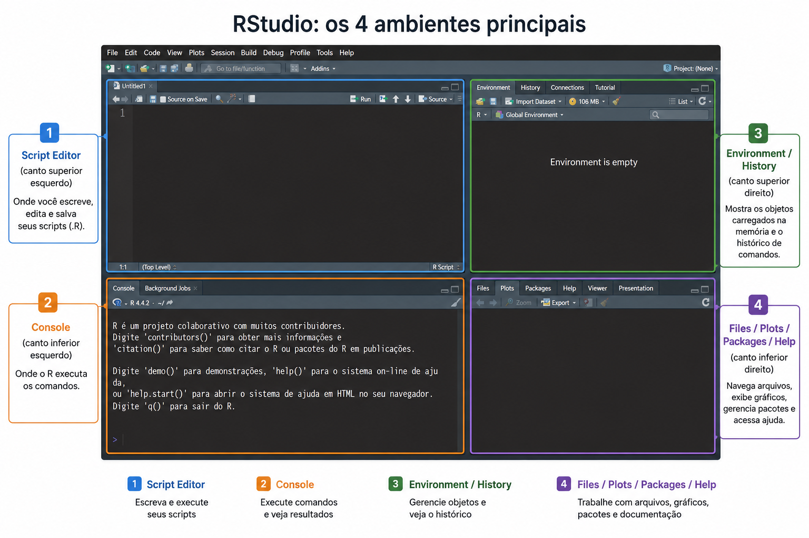
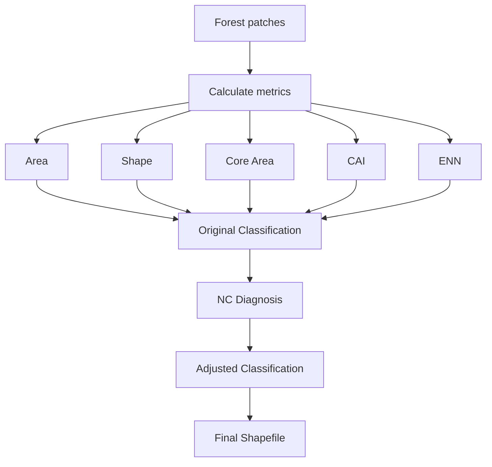
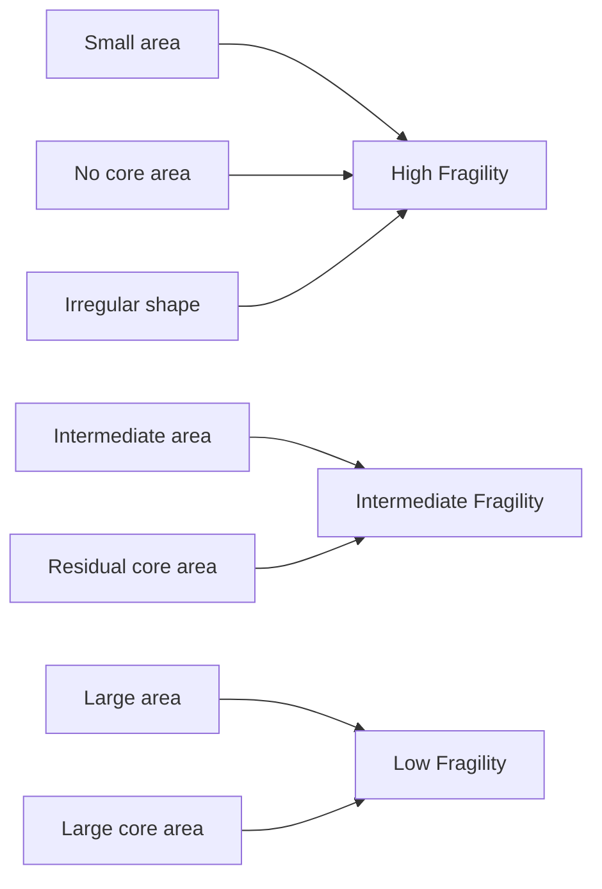

# Fragilidade Configuracional usando vectormetrics

R workflow for calculating landscape metrics and assessing configurational fragility of forest patches using vectormetrics, including diagnostics of unclassified profiles (NC).

---

# About this tutorial

This training was designed for beginners and introduces landscape metrics in R using vector spatial data.

At the end of this tutorial, participants will be able to:

- Load and inspect spatial data;
- Calculate landscape metrics;
- Classify configurational fragility;
- Diagnose unclassified profiles (NC);
- Export spatial outputs.

---

# Getting Started in R

## Understanding the RStudio Interface

RStudio is divided into four main panels:
## RStudio Interface

The figure below presents the four main environments of RStudio.



Source: adapted by the author.
### 1. Script Editor (Top Left)

Used to write, edit, and save scripts (.R).

Useful commands:

```r
Ctrl + Enter
```

Run selected line(s)

```r
Ctrl + Shift + S
```

Run entire script

```r
Ctrl + Shift + C
```

Comment/uncomment lines

---

### 2. Console (Bottom Left)

Where R executes commands.

Examples:

```r
2 + 2
```

```r
summary(data)
```

```r
head(data)
```

---

### 3. Environment / History (Top Right)

Environment shows objects loaded in memory.

Useful commands:

```r
ls()
```

List objects

```r
rm(list = ls())
```

Clear workspace

```r
object.size(vetor)
```

Check object size

---

### 4. Files / Plots / Packages / Help (Bottom Right)

Files → navigate folders

Plots → display graphs

Packages → manage packages

Help → access documentation

Useful commands:

```r
help(vm_p_area)
```

```r
?st_read
```

```r
library(sf)
```

---

# Useful Commands for This Tutorial

Set working directory:

```r
setwd("C:/Users/ENCOM/Documents/data_aula")
```

Check current directory:

```r
getwd()
```

Install packages:

```r
install.packages("sf")
```

Load packages:

```r
library(sf)
```

Read shapefile:

```r
st_read("FLORESTA_2023.shp")
```

View table:

```r
View(vetor)
```

Check structure:

```r
str(vetor)
```

Check missing values:

```r
colSums(is.na(vetor))
```

---

# Tutorial Workflow

```text
1. Load spatial data
2. Verify projection (CRS)
3. Calculate landscape metrics
4. Apply original fragility classification
5. Diagnose NC profiles
6. Adjust classification
7. Export outputs
```

---

# Landscape Metrics

| Metric | Description |
|--------|-------------|
| Area | Patch area |
| Shape | Shape complexity |
| Core Area | Interior habitat |
| CAI | Core Area Index |
| ENN | Euclidean Nearest Neighbor |

---

# Conceptual Model



---
---

# Configurational Fragility Classification

Configurational fragility represents the structural vulnerability of forest patches based on three attributes:

- **Area** → fragment size;
- **CAI (Core Area Index)** → amount of interior habitat;
- **Shape (MSI)** → patch compactness or irregularity.

Lower fragility is associated with:
- larger patches;
- greater core area;
- more compact shapes.

Higher fragility is associated with:
- smaller patches;
- absence of core area;
- irregular shapes.

## Classification Rules

| Fragility Level | Area | CAI | Shape (MSI) | Interpretation |
|------|------|------|------|------|
| AL-I | ≤ 1 ha | 0 | Any | Very small fragments without core area |
| AL-II | 1–5 ha | 0 | ≥ 1.5 | Small irregular fragments |
| AL-III | 1–5 ha | 0 | < 1.5 | Small compact fragments |
| AL-IV | 1–5 ha | > 0 | ≥ 1.5 | Small fragments with residual core |
| AL-V | 1–5 ha | > 0 | < 1.5 | Small fragments with compact shapes |
| IN-I | 5–50 ha | > 0 | ≥ 1.5 | Intermediate fragments with irregular shape |
| IN-II | 5–50 ha | > 0 | < 1.5 | Intermediate fragments with compact shape |
| IN-III* | 5–50 ha | 0 | ≥ 1.5 | Diagnostic subclass created after NC evaluation |
| IN-IV* | 5–50 ha | 0 | < 1.5 | Diagnostic subclass created after NC evaluation |
| BA-I | ≥ 50 ha | < 25% | ≥ 1.5 | Large fragments with irregular shape |
| BA-II | ≥ 50 ha | < 25% | < 1.5 | Large fragments with compact shape |
| BA-III | ≥ 50 ha | ≥ 25% | ≥ 1.5 | Large fragments with favorable conditions |
| BA-IV | ≥ 50 ha | ≥ 25% | < 1.5 | Large fragments with lowest configurational fragility |

\* Intermediate subclasses added after evaluating non-classified profiles (NC).

---

## Visual interpretation



---

## NC Diagnosis

Some patches may not fit the original classification rules.

These fragments are temporarily classified as:

```text
NC = Not Classified
```

The workflow exports diagnostic tables to evaluate:

- recurring profile combinations;
- possible rule adjustments;
- inclusion into existing or new fragility classes.

Generated files:

- `diagnostico_fragmentos_NC.csv`
- `perfil_resumido_NC.csv`
  
# Outputs

This workflow generates:

- Landscape metrics table
- Fragility classification
- NC diagnostics
- Final shapefile

---

# Packages

- vectormetrics
- sf
- dplyr
- tidyr
- ggplot2

---

# Author

Jessyca Janyny de Oliveira Saraiva-Maia
